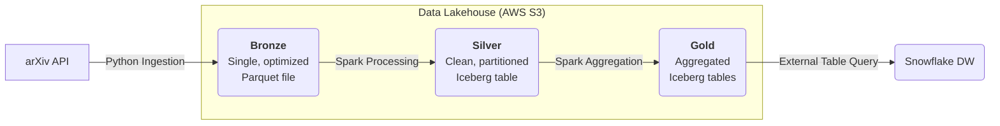

# End-to-End Data Lakehouse with Spark, Iceberg, and Snowflake

[](https://github.com/BrunoChiconato/lakehouse-from-scratch/actions/workflows/ci.yml)
[](https://codecov.io/gh/BrunoChiconato/lakehouse-from-scratch)

This end-to-end data engineering project demonstrates how to build a transactional Data Lakehouse on AWS S3 using a modern data stack. The solution ingests data from the public arXiv API, processes it through a Medallion Architecture (Bronze, Silver, Gold) with Apache Spark and Apache Iceberg, and makes it available for high-performance analytics in Snowflake.

## Table of Contents

- [Highlights](#-highlights)
- [Project Architecture](#-project-architecture)
- [Technology Stack](#-technology-stack)
- [Prerequisites](#-prerequisites)
- [Installation and Setup](#-installation-and-setup)
- [Usage](#-usage)
- [Project File Structure](#-project-file-structure)
- [Snowflake Integration](#-snowflake-integration)
- [Architectural Decisions](#-architectural-decisions)


## Highlights

This project serves as a practical implementation of several key modern data engineering concepts:

-   **Modern Data Stack:** Utilizes Docker, Python, Apache Spark, and Apache Iceberg for a robust and scalable solution.
-   **Medallion Architecture:** Organizes data into Bronze (raw), Silver (cleaned, transactional), and Gold (aggregated, business-ready) layers for reliability and governance.
-   **Transactional Data Lake:** Leverages Apache Iceberg to provide ACID transactions, schema evolution, and time-travel capabilities directly on S3, solving common Data Lake challenges.
-   **Decoupled Storage and Compute:** AWS S3 acts as the central, persistent storage layer, while Apache Spark (running locally via Docker) provides the flexible compute power for data processing.
-   **Seamless Cloud DW Integration:** Demonstrates how the final Gold layer tables in the Lakehouse can be transparently queried by Snowflake for advanced BI and analytics.

## Project Architecture

The project follows the Medallion Architecture to ensure a reliable and governed data flow, from ingestion to the consumption layer.



1.  **Bronze Layer:** Data from the API is ingested, validated, and saved as a single, optimized Parquet file in S3.
2.  **Silver Layer:** The Parquet file from the Bronze layer is read by Spark, where the data is cleaned, structured with a defined schema, and loaded into a transactional, partitioned Iceberg table.
3.  **Gold Layer:** The Silver layer tables are used as a source to create aggregated dimension and fact tables, ready for business analysis, also in Iceberg format.

## Technology Stack

| Tool | Purpose |
| :--- | :--- |
| **Docker** | Orchestration & Development Environment |
| **Python** | Main language for ingestion and scripting |
| **Apache Spark** | Distributed processing framework |
| **Apache Iceberg** | Table format for the Data Lakehouse (ACID) |
| **AWS S3** | Storage Layer (Data Lake) |
| **Snowflake** | Data Warehouse for data consumption |
| **Pydantic** | Data contracts and validation |
| **Makefile** | Command-line interface for automation |
| **Ruff** | Code linter and formatter |

## Prerequisites

  - AWS Account
  - IAM User with programmatic access (Access Key & Secret Key) and permissions for the S3 bucket.
  - A unique S3 Bucket to serve as the Data Lake.
  - Docker and Docker Compose installed.
  - Python 3.13.
  - Snowflake Account

## Installation and Setup

Follow these steps to set up the local development environment.

1.  **Clone the Repository**

    ```bash
    git clone https://github.com/BrunoChiconato/lakehouse-from-scratch.git
    cd lakehouse-from-scratch
    ```

2.  **Configure Environment Variables**
    Copy the `.env.example` file to a new file named `.env` and fill it with your AWS credentials and S3 bucket name.

    ```bash
    cp .env.example .env
    ```

    **Then, edit the `.env` file with your values.**

3.  **Build the Docker Environment**
    This command will build the Docker image containing all necessary dependencies (Python, Java, Spark, etc.).

    ```bash
    make build
    ```

4.  **Start the Services**
    This command starts the container in the background.

    ```bash
    make up
    ```

## Usage

You can run each step of the pipeline individually or the entire flow at once using the `Makefile` commands.

  - **Run the Full Pipeline (Bronze → Silver → Gold):**

    ```bash
    make run_full_pipeline
    ```

  - **Run Individual Steps:**

    ```bash
    # Step 1: Ingest data from the API to the Bronze layer
    make bronze

    # Step 2: Process data into the Silver layer
    make silver

    # Step 3: Build aggregated tables in the Gold layer
    make gold
    ```

  - **Access the Container Shell:**
    For debugging or running ad-hoc commands.

    ```bash
    make shell
    ```

## Project File Structure

The project is organized to separate concerns and improve maintainability.

```
.
├── .dockerignore
├── .env
├── .env.example
├── .gitignore
├── .python-version
├── docker-compose.yml
├── Dockerfile
├── Makefile
├── pyproject.toml
├── README.md
├── requirements.txt
├── uv.lock
└── src
    ├── config
    │   └── settings.py
    ├── contracts
    │   └── arxiv_contract.py
    ├── ingestion
    │   ├── api_client.py
    │   ├── main.py
    │   └── writer.py
    ├── transformation
    │   ├── build_gold_layer.py
    │   └── process_to_silver.py
    └── utils
        ├── logging_setup.py
        └── spark_utils.py
```

## Snowflake Integration

The Iceberg tables in the Gold layer can be queried directly from Snowflake as if they were native tables. This requires setting up a `STORAGE INTEGRATION` (to securely connect Snowflake to your S3) and a `CATALOG INTEGRATION` (to allow Snowflake to read the Iceberg metadata).

**Example Query in Snowflake after setup:**

```sql
-- Querying the publication trends table
SELECT
    category_name,
    SUM(paper_count) AS total_papers
FROM analytics.fact_publication_trends
WHERE publication_year > 2022
GROUP BY category_name
ORDER BY total_papers DESC
LIMIT 10;
```

## Architectural Decisions

  - **Why Iceberg?** Iceberg was chosen for its open, platform-independent metadata format, which avoids vendor lock-in, as well as its robust transactional guarantees (ACID) on the data lake.
  - **Why Spark?** While the initial data volume could be handled by other libraries, using Spark from the outset builds a scalable foundation, ready for future growth without a complete architectural redesign.
  - **Business Problem Solved:** The ability to perform `MERGE` (upsert) transactions simulates real-world scenarios where data must be corrected post-ingestion (e.g., fixing categories), a critical capability not offered by a traditional Parquet-based Data Lake.