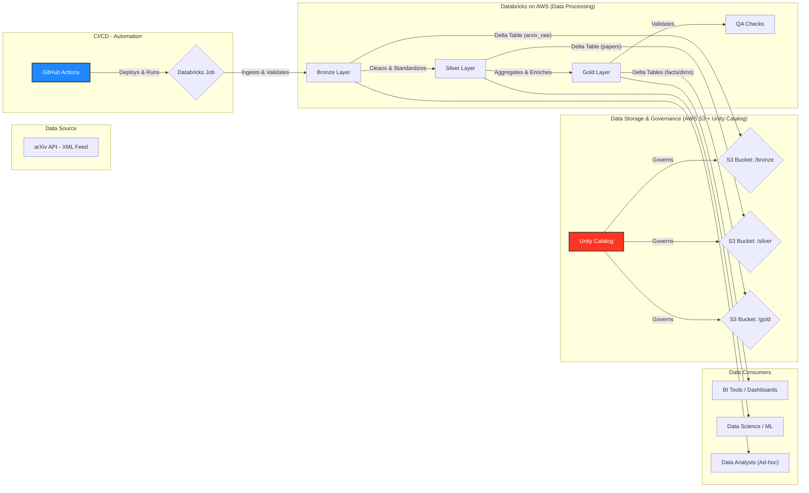

# arXiv Lakehouse: End-to-End Data Engineering Project on Databricks & AWS

An end-to-end data pipeline that ingests computer science papers from the arXiv API, processes them through a Bronze-Silver-Gold Medallion Architecture, and serves analytics-ready data using Databricks and Unity Catalog on AWS.

[](https://github.com/BrunoChiconato/lakehouse-from-scratch/actions/workflows/ci.yml)
[](https://codecov.io/gh/BrunoChiconato/lakehouse-from-scratch)


## 1. About The Project

This project implements a complete, production-grade data lakehouse on the AWS cloud, orchestrated by Databricks. It addresses the common challenge of sourcing, structuring, and governing public data for analytics. By fetching academic paper metadata from the public arXiv API, it builds a reliable, multi-layered data asset ready for business intelligence, data science, and machine learning applications.

**Key Objectives & Motivation:**

* **Problem:** Raw, unstructured data from APIs (like arXiv's XML feed) is difficult to query and analyze directly. It requires robust processing, validation, and structuring to become a trustworthy asset.
* **Solution:** This pipeline automates the entire ETL (Extract, Transform, Load) process. It ingests data, validates it against a data contract, cleans and standardizes it through a Medallion Architecture (Bronze, Silver, Gold layers), and stores it in a query-optimized format (Delta Lake) on S3.
* **Target Audience:** This solution is designed for data teams (analysts, engineers, scientists) who need reliable, up-to-date, and well-governed datasets for their analytical workflows.

## 2. Architecture

This project is built upon the **Medallion Architecture**, a best practice for logically organizing data in a lakehouse. This approach ensures data quality, traceability, and enables a variety of workloads from basic BI to advanced analytics. All data and governance are managed by **Databricks Unity Catalog**, providing a centralized security and discovery layer.



### Architectural Decisions & Trade-offs:

  * **Databricks Asset Bundles (DABs):** The entire project is packaged as a Databricks Asset Bundle (`databricks.yml`). This is a modern "infrastructure-as-code" approach that bundles all source code, configurations, and job definitions into a single, versionable unit, ensuring reproducible deployments.
  * **Python Wheel Tasks:** Instead of notebooks, the pipeline logic is written in modular Python scripts and packaged into a wheel file (`.whl`). This promotes software engineering best practices like unit testing, dependency management, and code reuse.
  * **Unity Catalog (UC):** UC is used for centralized governance. By defining a catalog, schemas, and external locations, we gain fine-grained access control, data lineage, and a unified metastore for all assets, regardless of the workspace.
  * **Serverless Jobs:** The Databricks job is configured to run on serverless compute. This minimizes operational overhead and cost, as we only pay for the exact compute resources used during the pipeline execution.
  * **Trade-off (Serverless Cold Starts):** While cost-effective, serverless compute can sometimes experience "cold starts," which may slightly increase latency for the first run of an infrequent job. For this project's batch nature, this trade-off is acceptable in exchange for operational simplicity.

## 3. Tech Stack

This project leverages a modern stack for data engineering, emphasizing automation, quality, and scalability.

| Category | Technologies |
| :--- | :--- |
| **Language** | <a href="https://www.python.org" target="_blank" rel="noreferrer">  </a> |
| **Data Platform** | <a href="https://www.databricks.com/" target="_blank" rel="noreferrer">  </a> <a href="https://spark.apache.org/" target="_blank" rel="noreferrer">  </a> |
| **Cloud Provider**| <a href="https://aws.amazon.com" target="_blank" rel="noreferrer">  </a> |
| **CI/CD** | <a href="https://github.com/features/actions" target="_blank" rel="noreferrer">  </a> |
| **Code Quality** | <a href="https://docs.pytest.org/en/stable/" target="_blank" rel="noreferrer">  </a> <a href="https://ruff.rs/" target="_blank" rel="noreferrer">  </a> <a href="https://about.codecov.io/" target="_blank" rel="noreferrer">  </a> |

## 4. Getting Started

To get this project up and running, you'll need to configure the cloud infrastructure on AWS and then set up your local development environment.

### 4.1. Prerequisites

  * An **AWS Account** with permissions to create S3 buckets and IAM roles.
  * A **Databricks Workspace** on AWS with Unity Catalog enabled.
  * **Python 3.12** or higher.
  * **Git** installed on your local machine.

### 4.2. Cloud Infrastructure Setup

This section guides you through setting up the necessary AWS resources and connecting them to Databricks Unity Catalog.

#### **Step 1: Configure AWS S3 Bucket**

The S3 bucket will store all the data for our lakehouse layers.

1.  **Create an S3 Bucket:**
      * Navigate to the S3 service in the AWS Console.
      * Create a new bucket (e.g., `your-arxiv-lakehouse-bucket`).
      * **Important:** The bucket must be in the same AWS region as your Databricks workspace.
      * Enable `Block all public access`.
      * Use default server-side encryption (`SSE-S3`).
2.  **Define Bucket Structure:** The pipeline will use the following directory structure inside the bucket:
    ```
    s3://<YOUR_BUCKET>/lakehouse/
      ├── bronze/
      ├── silver/
      ├── gold/
      └── analytics/
    ```

#### **Step 2: Configure AWS IAM Role for Databricks**

We will create an IAM Role that your Databricks workspace can assume to securely access the S3 bucket.

1.  **Create the IAM Role:**
      * In the IAM service, go to `Roles` and click `Create role`.
      * Select `AWS account` as the trusted entity type.
      * Choose `Another AWS account` and paste the **Databricks AWS Account ID** (`414351767826`) in the "Account ID" field.
      * Under `Options`, check the box for `Require external ID`. **Do not enter an ID yet.** We will get this from Databricks in the next step.
      * Name the role `databricks-lakehouse-access` and proceed.
2.  **Create and Attach Permissions Policy:**
      * After creating the role, create a new policy with the following JSON, replacing `<YOUR_BUCKET>` with your bucket name. This policy grants the minimum required permissions for the role to read from and write to the `lakehouse/` prefix in your bucket.
        ```json
        {
          "Version": "2012-10-17",
          "Statement": [
            {
              "Sid": "ListBucketLakehouse",
              "Effect": "Allow",
              "Action": "s3:ListBucket",
              "Resource": "arn:aws:s3:::<YOUR_BUCKET>",
              "Condition": { "StringLike": { "s3:prefix": "lakehouse/*" } }
            },
            {
              "Sid": "RWObjectsLakehouse",
              "Effect": "Allow",
              "Action": [
                "s3:GetObject", "s3:PutObject", "s3:DeleteObject",
                "s3:GetObjectVersion", "s3:DeleteObjectVersion"
              ],
              "Resource": "arn:aws:s3:::<YOUR_BUCKET>/lakehouse/*"
            }
          ]
        }
        ```
      * Name the policy (e.g., `DatabricksLakehouseS3AccessPolicy`) and attach it to the `databricks-lakehouse-access` role you created.

#### **Step 3: Configure Databricks Unity Catalog**

Now, we'll connect Databricks to your AWS resources using the role you just created.

1.  **Create a Storage Credential:**
      * In your Databricks workspace, navigate to the `Data` tab.
      * Click on `Storage Credentials` and then `Create credential`.
      * Set `Credential Type` to `AWS IAM Role`.
      * Paste the **ARN of the IAM role** you created (e.g., `arn:aws:iam::<YOUR_AWS_ACCOUNT_ID>:role/databricks-lakehouse-access`).
      * Databricks will now display an **External ID**. **Copy this ID.**
2.  **Update IAM Role Trust Policy:**
      * Go back to the `databricks-lakehouse-access` role in the AWS IAM console.
      * Go to the `Trust relationships` tab and click `Edit trust policy`.
      * Update the policy to include the `sts:ExternalId` condition, pasting the ID you copied from Databricks.
        ```json
        {
          "Version": "2012-10-17",
          "Statement": [
            {
              "Sid": "AllowDatabricksToAssume",
              "Effect": "Allow",
              "Principal": { "AWS": "arn:aws:iam::414351767826:root" },
              "Action": "sts:AssumeRole",
              "Condition": {
                "StringEquals": { "sts:ExternalId": "<PASTE_EXTERNAL_ID_FROM_DATABRICKS>" }
              }
            }
          ]
        }
        ```
      * Save the changes.
3.  **Create an External Location:**
      * Back in Databricks, create a new `External Location`.
      * Select the storage credential you just created.
      * Provide the URL to your S3 path: `s3://<YOUR_BUCKET>/lakehouse`.
      * Name it `ext_loc_lakehouse`.
4.  **Create Catalog and Schemas (via SQL Workspace):**
      * Open a new query in the SQL Editor and run the following commands to create the catalog and schemas that point to your external location.
        ```sql
        -- Create the main catalog for the project
        CREATE CATALOG IF NOT EXISTS lakehouse;
        USE CATALOG lakehouse;

        -- Grant necessary permissions (adjust group/user as needed)
        GRANT USAGE ON CATALOG lakehouse TO `account users`;
        GRANT CREATE SCHEMA ON CATALOG lakehouse TO `account users`;

        -- Create schemas for each layer, pointing to the specific S3 path
        CREATE SCHEMA IF NOT EXISTS bronze    LOCATION 's3://<YOUR_BUCKET>/lakehouse/bronze';
        CREATE SCHEMA IF NOT EXISTS silver    LOCATION 's3://<YOUR_BUCKET>/lakehouse/silver';
        CREATE SCHEMA IF NOT EXISTS gold      LOCATION 's3://<YOUR_BUCKET>/lakehouse/gold';
        CREATE SCHEMA IF NOT EXISTS analytics LOCATION 's3://<YOUR_BUCKET>/lakehouse/analytics';
        ```

### 4.3. Local Environment Setup

1.  **Clone the repository:**

    ```bash
    git clonehttps://github.com/BrunoChiconato/lakehouse-from-scratch.git
    cd lakehouse-from-scratch
    ```

2.  **Create and activate a virtual environment:**

    ```bash
    python3 -m venv venv
    source venv/bin/activate
    ```

3.  **Install project dependencies:** This command installs all required packages, including development tools like `pytest` and `ruff`.

    ```bash
    pip install -e ".[dev]"
    ```

4.  **Configure Databricks authentication:**

      * Create a `.env` file in the root of the project by copying the example:
        ```bash
        cp .env.example .env
        ```
      * Edit the `.env` file and add your Databricks host and a personal access token (PAT). This is required for the Databricks CLI to deploy the bundle.
        ```
        DATABRICKS_HOST=[https://your-workspace.cloud.databricks.com](https://your-workspace.cloud.databricks.com)
        DATABRICKS_TOKEN=dapi...
        ```

## 5. Usage

### 5.1. Deploying and Running the Pipeline

The project is deployed and run using the Databricks CLI and Asset Bundles.

1.  **Validate the Bundle:** Before deploying, check that the `databricks.yml` configuration is correct for your `dev` target.

    ```bash
    databricks bundle validate -t dev
    ```

2.  **Build the Python Wheel:** The project logic is packaged as a wheel file.

    ```bash
    python -m build --wheel
    ```

3.  **Deploy the Bundle:** This command uploads the wheel file and creates/updates the Databricks job defined in `databricks.yml`.

    ```bash
    # Capture the generated wheel filename
    WHEEL_NAME="$(ls -t dist/*.whl | head -n1 | xargs -n1 basename)"

    # Deploy the bundle, passing the wheel name as a variable
    databricks bundle deploy -t dev --var "wheel_file_name=${WHEEL_NAME}"
    ```

4.  **Run the Pipeline:** Trigger the deployed job to run the entire Bronze -> Silver -> Gold -> QA pipeline.

    ```bash
    databricks bundle run -t dev lakehouse-pipeline --refresh-all
    ```

### 5.2. Local Development Commands

A `Makefile` is provided for common development tasks.

  * **Lint and Format Code:**
    ```bash
    make linter
    ```
  * **Run All Tests:**
    ```bash
    make test
    ```
  * **Run Tests with Coverage Report:**
    ```bash
    make test-cov
    # This will generate an HTML report in the `htmlcov/` directory.
    ```

## 6. Testing Strategy

A robust testing suite is crucial for ensuring data quality and code reliability. This project employs a multi-layered testing strategy.

  * **Unit Tests (`tests/unit`):** These tests isolate and verify small pieces of logic, such as data contract validation (`test_arxiv_contract.py`) or API client behavior (`test_api_client.py`). They use mocking to avoid external dependencies.
  * **Module Tests (`tests/unit`):** These tests verify the orchestration logic within each main script (e.g., `test_ingestion_main.py`, `test_build_gold_layer_module.py`), mocking the Spark session and other dependencies to ensure functions are called correctly.
  * **Integration Tests (`tests/spark`):** These tests use a local `SparkSession` (see `conftest.py`) to verify the correctness of Spark transformations on small, in-memory DataFrames. They ensure that data cleaning (`test_silver_transform.py`) and aggregations (`test_gold_compute.py`) work as expected.

To run the complete test suite, execute:

```bash
make test # Or pytest tests/
```

## 7. CI/CD Pipeline

The project includes a continuous integration and deployment (CI/CD) pipeline using **GitHub Actions**, defined in `.github/workflows/ci.yml`. This pipeline automates quality checks and deployment for every push to the `main` branch.

**The pipeline performs the following steps:**

1.  **Checkout Code:** Clones the repository.
2.  **Setup Environment:** Sets up Java 11 (for Spark) and Python 3.12.
3.  **Install Dependencies:** Installs all project and development dependencies.
4.  **Linting:** Checks code formatting and style with `Ruff`.
5.  **Testing:** Runs the entire `pytest` suite and generates a coverage report.
6.  **Upload Coverage:** Uploads the test coverage report to Codecov for tracking.
7.  **Build & Deploy:** Builds the Python wheel and deploys the bundle to the `dev` environment on Databricks.
8.  **Run Pipeline:** Triggers the Databricks job to ensure the newly deployed code runs successfully end-to-end.

## 8. Contact

  * **Author:** Bruno Chiconato
  * **LinkedIn:** https://www.linkedin.com/in/brunochiconato/
  * **Project Link:** [https://github.com/BrunoChiconato/lakehouse-from-scratch](https://www.google.com/search?q=https://github.com/BrunoChiconato/lakehouse-from-scratch)